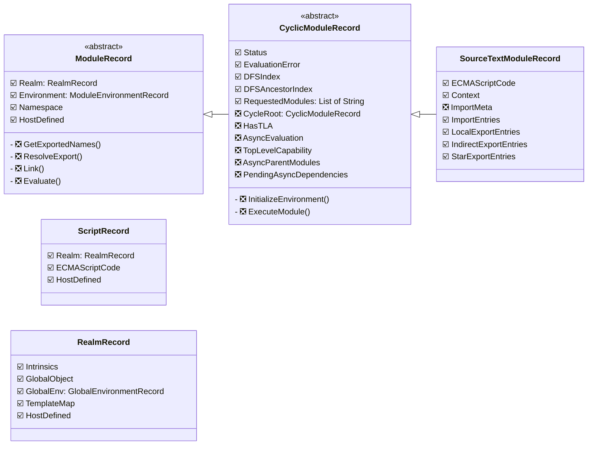
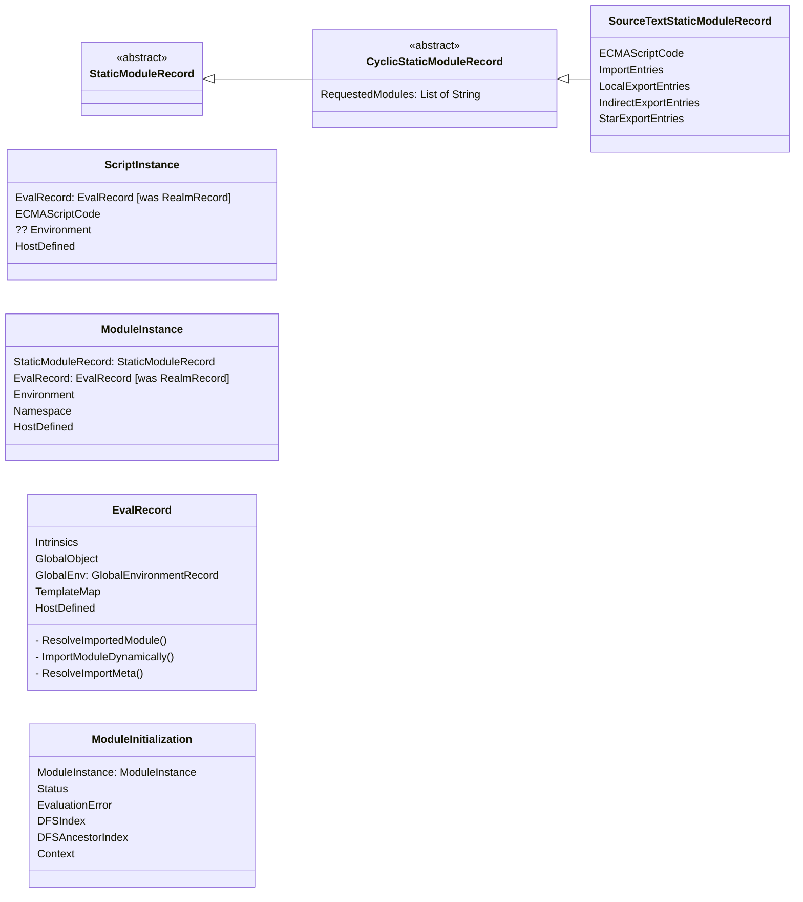

# ModuleRecord refactoring diagrams

The purpose of this document is to ensure complete understanding of changes proposed in README.md by an attempt to reproduce them in a different medium.

## Before

> `☑️` means the field has a known place in "After",  
> `❎` means it does not.

## After

# Notes

## Open questions

1. Why is CyclicStaticModuleRecord not abstract in the refactoring writeup? I made it abstract, seems like it simply wasn't stated
2. Is `ResolveImportMeta()` meant to replace `SourceTextModuleRecord.ImportMeta` ?
3. Was `Environment` originally not present in Script Record, because it was always using `Realm.GlobalEnv`? Does it change now?

## TODO
- find `referrer` and put it on the map
- figure out where fields marked with `-` in "Before" go
- (optionally) draw out relationships